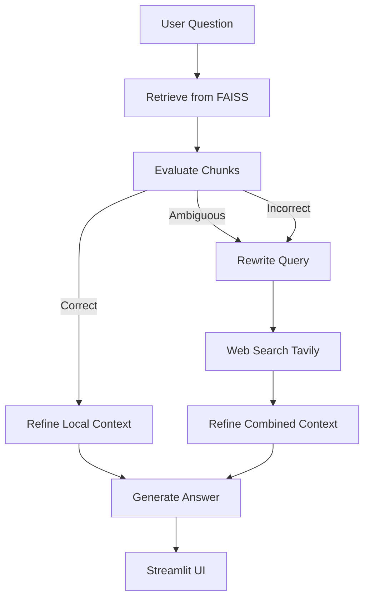

# CRAG (Corrective RAG)

CRAG is a corrective retrieval-augmented generation (RAG) app that evaluates retrieval quality, optionally falls back to web search, and then generates answers from a refined context. It runs as a Streamlit UI backed by a LangGraph workflow.

## What CRAG Does

- Loads PDF documents and builds a vector index for semantic retrieval.
- Evaluates each retrieved chunk for relevance using a strict grader.
- Routes the flow:
  - If retrieval is strong, it refines local context only.
  - If retrieval is weak or ambiguous, it rewrites the query and adds web search results.
- Filters sentences to keep only question-relevant evidence.
- Generates a final answer from the refined context.

## Workflow Diagram



## Project Structure

- [backend.py](backend.py) runs the LangGraph workflow and model calls.
- [frontend.py](frontend.py) provides the Streamlit UI.
- [documents/](documents/) holds PDF sources.
- [requirements.txt](requirements.txt) lists dependencies.

## Setup

1) Create and activate a virtual environment.
2) Install dependencies:

```bash
pip install -r requirements.txt
```

3) Create a .env file with your keys:

```
GOOGLE_API_KEY=your_gemini_key
TAVILY_API_KEY=your_tavily_key
```

## Run

Start the Streamlit app:

```bash
streamlit run frontend.py
```

## Notes on Performance

- The first run can be slow because embeddings are built and a FAISS index is created.
- After the index is saved, future runs should load faster.
- Set a Hugging Face token (HF_TOKEN) if you want faster model downloads and higher rate limits.

## Why This is Useful in Real Projects

CRAG is built for reliability over blind generation:

- It measures retrieval quality before answering.
- It uses web search when local data is weak.
- It filters context to reduce hallucinations.
- It provides a verdict and reason for transparency.
