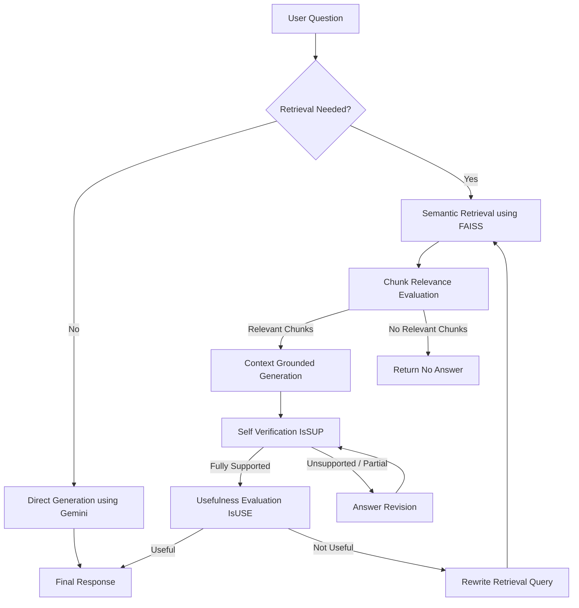

# Advanced SELF-RAG System using Gemini 2.5 Flash + LangGraph + FAISS

A production-style SELF-RAG (Self-Reflective Retrieval-Augmented Generation) system built using:

- Gemini 2.5 Flash
- LangGraph
- FAISS Vector Database
- Sentence Transformers
- Self Verification
- Self Correction
- Query Rewriting
- Retrieval Decision Routing

This project implements a complete SELF-RAG workflow where the system can:

- Decide whether retrieval is needed
- Retrieve relevant documents
- Filter relevant chunks
- Generate grounded answers
- Verify hallucinations
- Revise unsupported answers
- Judge answer usefulness
- Rewrite queries and retry retrieval

---

# Features

- SELF-RAG architecture
- Retrieval decision routing
- FAISS semantic retrieval
- Free local embeddings
- Gemini 2.5 Flash integration
- Self verification (IsSUP)
- Self usefulness checking (IsUSE)
- Query rewriting loop
- Hallucination reduction
- LangGraph workflow orchestration
- Multi-step reasoning pipeline

---

# Tech Stack

| Component | Technology |
|---|---|
| LLM | Gemini 2.5 Flash |
| Framework | LangChain |
| Workflow Engine | LangGraph |
| Vector Database | FAISS |
| Embeddings | all-MiniLM-L6-v2 |
| PDF Loader | PyPDFLoader |
| UI | Streamlit |

---

# Workflow Architecture

## SELF-RAG Workflow



---

# How SELF-RAG Works

## 1. Retrieval Decision

The system first decides:

```text
Does this query require external document retrieval?
```

Examples:

| Query | Retrieval Needed |
|---|---|
| "What is machine learning?" | ❌ |
| "What is NexaAI refund policy?" | ✅ |

---

## 2. Retrieval

Relevant document chunks are retrieved using:

- FAISS similarity search
- Sentence transformer embeddings

---

## 3. Relevance Filtering

Each retrieved chunk is evaluated:

```text
Is this chunk relevant to the question?
```

Irrelevant chunks are discarded.

---

## 4. Context-Based Generation

The model generates an answer using ONLY:

- retrieved context
- relevant chunks

This reduces hallucinations.

---

## 5. IsSUP Verification

The system verifies:

```text
Is the generated answer fully supported by context?
```

Possible outputs:

- fully_supported
- partially_supported
- no_support

---

## 6. Self Revision Loop

If answer is not fully supported:

- answer gets revised
- unsupported claims removed
- generation retried

This creates a self-correction loop.

---

## 7. IsUSE Verification

The system checks:

```text
Did the answer actually solve the user question?
```

Possible outputs:

- useful
- not_useful

---

## 8. Query Rewrite Loop

If answer is not useful:

- query rewritten for better retrieval
- retrieval retried
- generation repeated

This improves retrieval quality dynamically.

---

# Project Structure

```text
project/
│
├── backend.py
├── frontend.py
├── requirements.txt
├── .env
│
├── documents/
│   ├── Company_Policies.pdf
│   ├── Company_Profile.pdf
│   └── Product_and_Pricing.pdf
│
└── faiss_index/
```

---

# Installation

## Clone Repository

```bash
git clone <your_repo_url>
cd self-rag-project
```

---

## Create Virtual Environment

### Windows

```bash
python -m venv myenv
myenv\Scripts\activate
```

### Linux / Mac

```bash
python3 -m venv myenv
source myenv/bin/activate
```

---

## Install Dependencies

```bash
pip install -r requirements.txt
```

---

# Environment Variables

Create `.env` file:

```env
GOOGLE_API_KEY=your_gemini_api_key
```

---

# Add Documents

Place PDFs inside:

```text
documents/
```

Example:

```text
documents/
├── Company_Policies.pdf
├── Company_Profile.pdf
└── Product_and_Pricing.pdf
```

---

# Run Backend

```bash
python backend.py
```

---

# Run Streamlit UI

```bash
streamlit run frontend.py
```

---

# Example Queries

```text
Describe NexaAI company culture

What is the refund policy?

Does NexaAI provide free trial?

Explain probation policy

Who are the founders of NexaAI?
```

---

# Example Execution Flow

```text
Question:
Describe NexaAI company culture

↓

Retrieval Needed?
YES

↓

Retrieve Documents

↓

Filter Relevant Chunks

↓

Generate Answer

↓

Verify Support (IsSUP)

↓

Answer Useful? (IsUSE)

↓

Final Grounded Answer
```

---

# Why SELF-RAG is Better than Basic RAG

| Basic RAG | SELF-RAG |
|---|---|
| Single retrieval pass | Multi-step reasoning |
| No hallucination checking | Self verification |
| No answer correction | Self revision |
| Fixed retrieval | Query rewriting |
| Weak reliability | Strong grounding |
| Simple pipeline | Adaptive pipeline |

---

# Performance Advantages

SELF-RAG improves:

- retrieval quality
- grounding
- hallucination reduction
- answer reliability
- context precision
- adaptive retrieval

---

# Future Improvements

- Hybrid Search (BM25 + FAISS)
- Cross-Encoder Reranking
- Memory Integration
- Multi-Agent Workflows
- Streaming Responses
- Citations
- Async Execution
- PostgreSQL Vector Storage
- LangSmith Tracing
- Docker Deployment

---

# Recommended Python Version

```text
Python 3.11
```

---

# Recommended Embedding Model

```text
sentence-transformers/all-MiniLM-L6-v2
```

Why?

- free
- lightweight
- fast
- strong retrieval quality

---

# License

MIT License